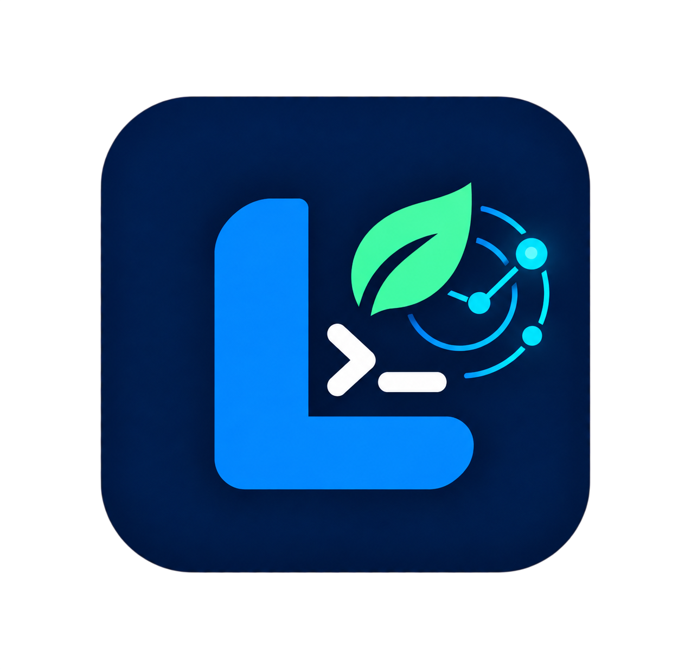
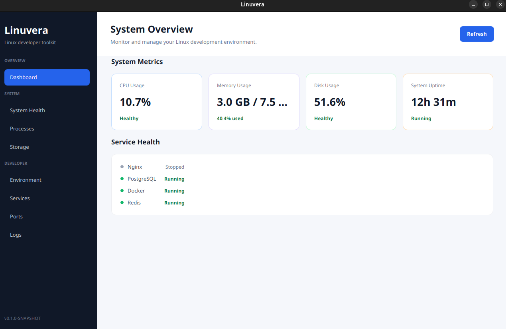
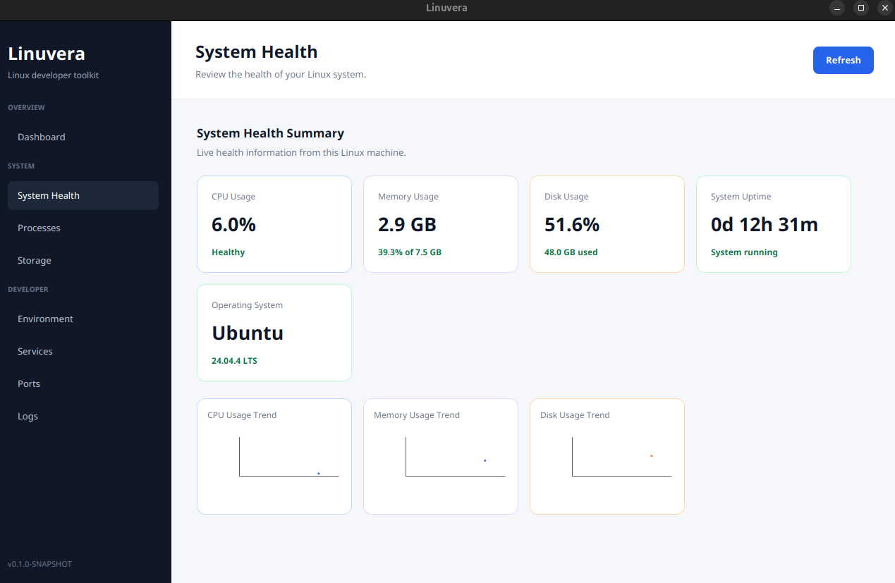
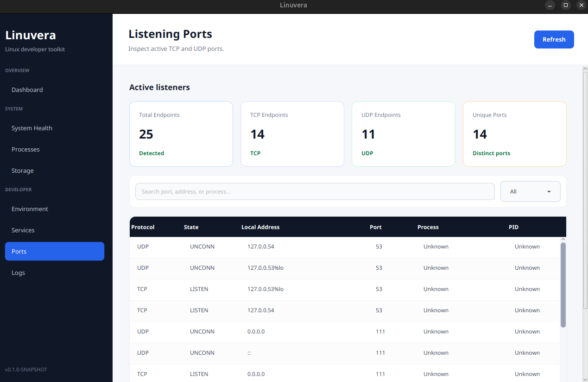

# Linuvera
[](https://github.com/IroshPerera/linuvera/actions)
[](https://opensource.org/licenses/MIT)
[](https://github.com/IroshPerera/linuvera/releases)

<p align="center">
  
</p>

Linuvera is an open-source Linux developer and system support toolkit built with JavaFX.

It gives Linux users a simple desktop application for monitoring system health, inspecting development tools, and reviewing common Linux runtime information without needing many terminal commands.

## Screenshots

### Dashboard



### System Health



### Listening Ports



## Features

### System monitoring

- System overview dashboard
- Live CPU, memory, disk, and uptime metrics
- System health summary
- CPU, memory, and disk usage charts
- Automatic data refresh
- Manual page refresh

### Linux inspection

- Running process monitoring
- Process search and resource usage
- Mounted filesystem and storage information
- Active TCP and UDP port inspection
- Port search and protocol filtering
- Linux systemd service monitoring
- Recent system logs viewer
- Log search and log-level filtering

### Developer environment

- Java detection
- Maven detection
- Git detection
- Node.js detection
- Docker detection
- PostgreSQL detection
- Redis detection

## Tech Stack

- Java 21
- JavaFX 21
- Maven
- OSHI 7.6.1
- JUnit 5
- Linux system commands

## Requirements

- Ubuntu or another Debian-based Linux distribution
- Java 21 or later
- Maven 3.8 or later
- `journalctl` for system log viewing
- `systemctl` for Linux service monitoring
- `ss` for active port inspection

## Run from Source

Run these commands from the project root:

```bash
mvn clean javafx:run
```

## Run Tests

```bash
mvn clean test
```

## Build a Debian Package

The project includes a packaging script that creates a self-contained Debian package with a bundled Java runtime, JavaFX runtime modules, dependencies, desktop launcher, and Linuvera icon.

Run from the project root:

```bash
bash scripts/build-deb.sh
```

The generated package is created at:

```text
target/dist/linuvera_0.1.3_amd64.deb
```

## Install the Debian Package

```bash
sudo apt install --reinstall \
  ./target/dist/linuvera_0.1.3_amd64.deb
```

After installation, launch Linuvera with:

```bash
/opt/linuvera/bin/Linuvera
```

The package also adds Linuvera to the desktop application menu.

## Project Structure

```text
src/
├── main/
│   ├── java/io/github/iroshperera/linuvera/
│   │   ├── system/          # Linux and OSHI data services
│   │   ├── ui/              # JavaFX views and UI logic
│   │   ├── ApplicationMetadata.java
│   │   └── LinuveraApplication.java
│   └── resources/
│       ├── application.css
│       └── packaging/
│           └── linuvera-icon.png
├── scripts/
│   └── build-deb.sh
└── pom.xml
```

## Application Design

Linuvera follows a simple separation between the JavaFX UI layer and Linux data services:

- `ui` classes render pages and handle user interactions.
- `system` classes collect operating-system and developer-environment data.
- JavaFX updates UI values on the JavaFX Application Thread.
- Read-only system inspection is used for the current application modules.

## Project Status

Linuvera is currently under active development.

The current version focuses on read-only Linux system monitoring, developer environment inspection, service inspection, process monitoring, storage information, logs, ports, and Debian packaging.

## Known Limitations

- Currently focused on Ubuntu and Debian-based Linux distributions.
- Some features depend on Linux commands such as `systemctl`, `journalctl`, and `ss`.
- The current modules are primarily read-only monitoring tools.
- Service and process control actions are not available yet.
- Some system information may require additional user permissions.
- The Debian package currently targets amd64 systems.

## Open Source

Contributions, suggestions, bug reports, and feature ideas are welcome.

## License

Linuvera is licensed under the MIT License. See the [LICENSE](LICENSE) file for details.